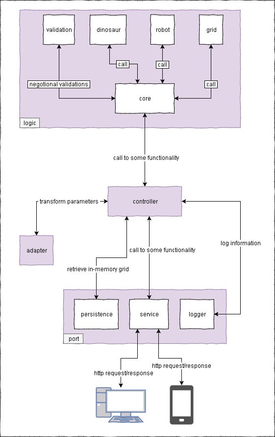

# The Project
Hello,  
thanks for your time reviewing my application exercise.  

This project has been a great opportunity to get me out of my comfort zone. I still have A LOT to learn about functional programming, Clojure, hexagonal architecture and many other subjects that I needed to study. That's exactly why it makes more fun, been able to learn and make new things is certainly motivating. Several questions appeared, some of them I found
a solution, others I made note so I can search after this step (the last days has been all about my work and this project).

Following the [instructions](nubank_exercise.md) that were given to me, I chose the **Problem 1 - Robots vs Dinosaurs**.

## First Steps
I did some research involving functional programming, its differences compared to object-oriented, Clojure, hexagonal architecture.  
I needed the base concept so this exercise could work. I made notes to the [links](sources.md) that I used during the project.

## The Design
Basically, the following image is my understanding of this project, and what was made.  

## How It Works
The actions were designed in other to apply an action to the grid, or a position in the grid. The functions will generate 
a new grid which will update the persistence. 

